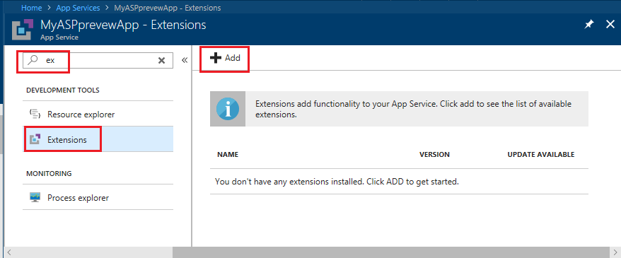
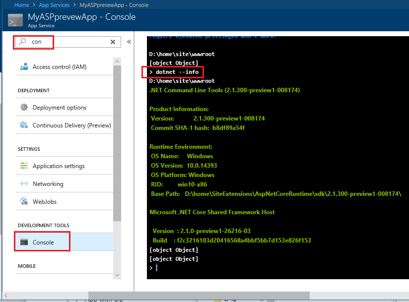

# Host ASP.NET Core on Azure App Service

[Azure App Service](https://azure.microsoft.com/services/app-service/) is a [Microsoft cloud computing platform service](https://azure.microsoft.com/) for hosting web apps, including ASP.NET Core.

## Useful resources

The Azure [Web Apps Documentation](/azure/app-service/) is the home for Azure Apps documentation, tutorials, samples, how-to guides, and other resources. Two notable tutorials that pertain to hosting ASP.NET Core apps are:

[Quickstart: Create an ASP.NET Core web app in Azure](/azure/app-service/app-service-web-get-started-dotnet)  
Use Visual Studio to create and deploy an ASP.NET Core web app to Azure App Service on Windows.

[Quickstart: Create a .NET Core web app in App Service on Linux](/azure/app-service/containers/quickstart-dotnetcore)  
Use the command line to create and deploy an ASP.NET Core web app to Azure App Service on Linux.

The following articles are available in ASP.NET Core documentation:

[Publish to Azure with Visual Studio](xref:tutorials/publish-to-azure-webapp-using-vs)  
Learn how to publish an ASP.NET Core app to Azure App Service using Visual Studio.

[Publish to Azure with CLI tools](xref:tutorials/publish-to-azure-webapp-using-cli)  
Learn how to publish an ASP.NET Core app to Azure App Service using the Git command-line client.

[Continuous deployment to Azure with Visual Studio and Git](xref:host-and-deploy/azure-apps/azure-continuous-deployment)  
Learn how to create an ASP.NET Core web app using Visual Studio and deploy it to Azure App Service using Git for continuous deployment.

[Continuous deployment to Azure with VSTS](https://www.visualstudio.com/docs/build/aspnet/core/quick-to-azure)  
Set up a CI build for an ASP.NET Core app, then create a continuous deployment release to Azure App Service.

[Azure Web App sandbox](https://github.com/projectkudu/kudu/wiki/Azure-Web-App-sandbox)  
Discover Azure App Service runtime execution limitations enforced by the Azure Apps platform.

## Application configuration

With ASP.NET Core 2.0 and later, three packages in the [Microsoft.AspNetCore.All metapackage](xref:fundamentals/metapackage) provide automatic logging features for apps deployed to Azure App Service:

* [Microsoft.AspNetCore.AzureAppServices.HostingStartup](https://www.nuget.org/packages/Microsoft.AspNetCore.AzureAppServices.HostingStartup/) uses [IHostingStartup](xref:host-and-deploy/platform-specific-configuration) to provide ASP.NET Core lightup integration with Azure App Service. The added logging features are provided by the `Microsoft.AspNetCore.AzureAppServicesIntegration` package.
* [Microsoft.AspNetCore.AzureAppServicesIntegration](https://www.nuget.org/packages/Microsoft.AspNetCore.AzureAppServicesIntegration/) executes [AddAzureWebAppDiagnostics](/dotnet/api/microsoft.extensions.logging.azureappservicesloggerfactoryextensions.addazurewebappdiagnostics) to add Azure App Service diagnostics logging providers in the `Microsoft.Extensions.Logging.AzureAppServices` package.
* [Microsoft.Extensions.Logging.AzureAppServices](https://www.nuget.org/packages/Microsoft.Extensions.Logging.AzureAppServices/) provides logger implementations to support Azure App Service diagnostics logs and log streaming features.

## Proxy server and load balancer scenarios

The IIS Integration Middleware, which configures Forwarded Headers Middleware, and the ASP.NET Core Module are configured to forward the scheme (HTTP/HTTPS) and the remote IP address where the request originated. Additional configuration might be required for apps hosted behind additional proxy servers and load balancers. For more information, see [Configure ASP.NET Core to work with proxy servers and load balancers](xref:host-and-deploy/proxy-load-balancer).

## Monitoring and logging

For monitoring, logging, and troubleshooting information, see the following articles:

[How to: Monitor Apps in Azure App Service](/azure/app-service/web-sites-monitor)  
Learn how to review quotas and metrics for apps and App Service plans.

[Enable diagnostics logging for web apps in Azure App Service](/azure/app-service/web-sites-enable-diagnostic-log)  
Discover how to enable and access diagnostic logging for HTTP status codes, failed requests, and web server activity.

[Introduction to Error Handling in ASP.NET Core](xref:fundamentals/error-handling)  
Understand common appoaches to handling errors in ASP.NET Core apps.

[Troubleshoot ASP.NET Core on Azure App Service](xref:host-and-deploy/azure-apps/troubleshoot)  
Learn how to diagnose issues with Azure App Service deployments with ASP.NET Core apps.

[Common errors reference for Azure App Service and IIS with ASP.NET Core](xref:host-and-deploy/azure-iis-errors-reference)  
See the common deployment configuration errors for apps hosted by Azure App Service/IIS with troubleshooting advice.

## Data Protection key ring and deployment slots

[Data Protection keys](xref:security/data-protection/implementation/key-management#data-protection-implementation-key-management) are persisted to the *%HOME%\ASP.NET\DataProtection-Keys* folder. This folder is backed by network storage and is synchronized across all machines hosting the app. Keys aren't protected at rest. This folder supplies the key ring to all instances of an app in a single deployment slot. Separate deployment slots, such as Staging and Production, don't share a key ring.

When swapping between deployment slots, any system using data protection won't be able to decrypt stored data using the key ring inside the previous slot. ASP.NET Cookie Middleware uses data protection to protect its cookies. This leads to users being signed out of an app that uses the standard ASP.NET Cookie Middleware. For a slot-independent key ring solution, use an external key ring provider, such as:

* Azure Blob Storage
* Azure Key Vault
* SQL store
* Redis cache

For more information, see [Key storage providers](xref:security/data-protection/implementation/key-storage-providers).

## Deploy ASP.NET Core preview release to Azure App Service

ASP.NET Core preview apps can be deployed to Azure App Service with the following approaches:

* [Install the preview site extention](#site-x)
* [Deploy the app self contained](#self)
* [Use Docker with Web Apps for containers](#docker)

If you have a problem using the preview site extension, open an issue on [GitHub](https://github.com/aspnet/azureintegration/issues/new).

###Install the preview site extention

* From the Azure portal, navigate to the App Service blade.
* Enter "ex" in the search box.
* Select **Extensions**.
* Select "Add".

* Select **ASP.NET Core Runtime Extensions**.
* Select **OK** > **OK**.

When the add operations completes, the latest .NET Core 2.1 preview is installed. You can verify the installation by running `dotnet --info` in the console. From the App Service blade:

* Enter "con" in the search box.
* Select **Console**.
* Enter `dotnet --info` in the console.

The preceding image was current at the time this was written. You may see a different version.

The `dotnet --info` displays the the path to the site extension where the Preview has been installed. It shows the app is running from the site extension instead of from the default *ProgramFiles* location. If you see *ProgramFiles*, restart the site and run `dotnet --info`.

#### Use the preview site extention with an ARM template

If you are using an ARM template to create and deploy applications you can use the `siteextensions` resource type to add the site extension to a Web App. For example:

[!code-json[Main](index/sample/arm.json?highlight=2)]

### Deploy the app self contained

You can deploy a [self-contained app](/dotnet/core/deploying/#self-contained-deployments-scd) that carries the preview runtime with it when being deployed. When deploying a self contained app:

* You don’t need to prepare your site.
* Requires you to publish your application differently than you would when deploying an app once the SDK is installed on the server.

Self-contained apps are an option for all .NET Core applications.

### Use Docker with Web Apps for containers

The [Docker Hub](https://hub.docker.com/r/microsoft/aspnetcore/) contains a 2.1 preview1 Docker images. You can use them as your base image and deploy to Web Apps for Containers as you normally would.

## Additional resources

* [Web Apps overview (5-minute overview video)](/azure/app-service/app-service-web-overview)
* [Azure App Service: The Best Place to Host your .NET Apps (55-minute overview video)](https://channel9.msdn.com/events/dotnetConf/2017/T222)
* [Azure Friday: Azure App Service Diagnostic and Troubleshooting Experience (12-minute video)](https://channel9.msdn.com/Shows/Azure-Friday/Azure-App-Service-Diagnostic-and-Troubleshooting-Experience)
* [Azure App Service diagnostics overview](/azure/app-service/app-service-diagnostics)

Azure App Service on Windows Server uses [Internet Information Services (IIS)](https://www.iis.net/). The following topics pertain to the underlying IIS technology:

* [Host ASP.NET Core on Windows with IIS](xref:host-and-deploy/iis/index)
* [Introduction to ASP.NET Core Module](xref:fundamentals/servers/aspnet-core-module)
* [ASP.NET Core Module configuration reference](xref:host-and-deploy/aspnet-core-module)
* [IIS Modules with ASP.NET Core](xref:host-and-deploy/iis/modules)
* [Microsoft TechNet Library: Windows Server](/windows-server/windows-server-versions)
